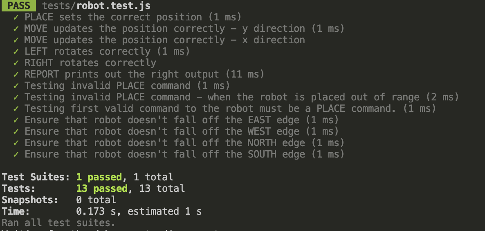

# Toy-Robot-Simulator

## Overview

The Toy Robot Simulator is a Node.js application that simulates a toy robot moving on a 5x5 grid table top by default. The robot follows a set of commands to move, turn and report its position while ensuring that it does not fall off the table.

## Features

- The robot is placed on a 5x5 grid by default
- Supports movement in four directions: NORTH, SOUTH, WEST, EAST
- The robot can rotate left (90-degree anticlockwise) or right (90-degree clockwise)
- Prevent movements which cause the robot to fall off the table
- Reports its current x,y position and facing direction
- Inputs are taken from command line.
- Ignore invalid commands
- Test is included.

## Logic

- Table Class (table.js): Manages the grid size and validates whether a position is within bounds. The default size is 5x5, but this can be modified when instantiating the table. Since grid-based coordinates in programming are zero-indexed, the valid range for both X and Y coordinates in a 5x5 grid is 0 to 4 (inclusive).

- Robot Class (robot.js): Handles the robot's position, direction, and movement logic. It ensures that any move remains within the valid grid boundaries.

- Commands Processing (commands.js): Parses input commands and executes the appropriate actions on the robot. This includes validation to ignore invalid commands.

- Main Execution (index.js): Reads command-line input, processes commands, and integrates with the Robot and Table classes. Allows user to exit gracefully.

## Installation

### Steps to install

1. Clone this repository:

   ```
   git clone https://github.com/ambo-n/Toy-Robot-Simulator.git

   cd Toy-Robot-Simulator
   ```

2. Install dependencies:
   ```
   npm install
   ```

## Usage

### Running the application

To run the application and interact with the robot via the command line:

```
node src/index.js
```

### Valid commands:

The application processes these following commands:

- `PLACE X,Y,FACING` - Places the robot at (X,Y) facing NORTH, SOUTH, EAST or WEST. X,Y are integers
- `MOVE` - Moves the toy robot one unit forward in the direction it is currently facing.
- `LEFT` - Rotates the robot 90° anticlockwise without changing its position.
- `RIGHT` - Rotates the robot 90° clockwise without changing its position.
- `REPORT` - Outputs the X,Y, and facing direction of the robot.

##### Example Input:

```
PLACE 0,0,NORTH
MOVE
REPORT
```

##### Example Output:

```
Output: 0, 1, NORTH
```

### Running test

Unit tests are included to ensure correct functionality. Run the tests with:

```
npm test
```

#### Program execution example


#### Expected test results when running unit tests



